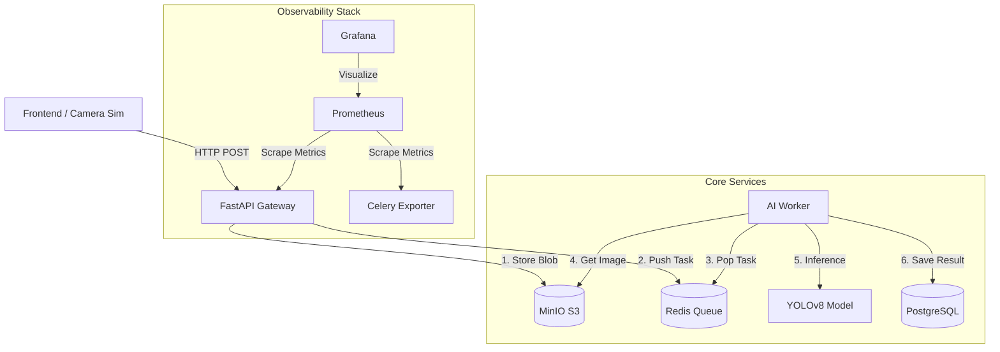
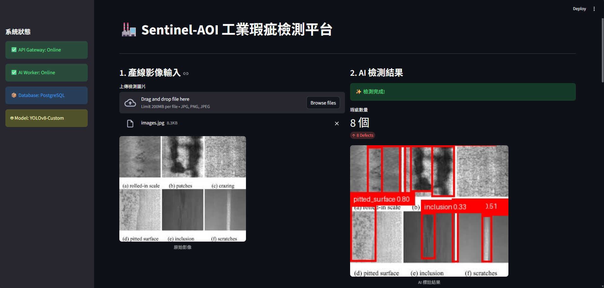
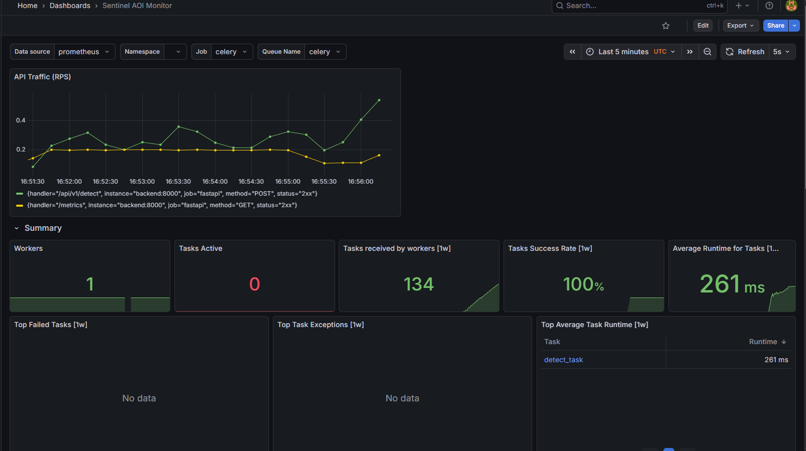

# Sentinel-AOI: 工業級自動光學檢測系統 (Enterprise AI Inspection System)

    

## 📖 專案簡介 (Introduction)
Sentinel-AOI 是一個模擬半導體與鋼鐵製造業場景的 **微服務架構 (Microservices)** 檢測系統。
本專案解決了工業場景中「高併發影像串流」與「即時 AI 推論」的整合難題。透過 **非同步隊列**、**背壓機制** 與 **全觀測性監控**，實現了高可用的產線自動化檢測 (AOI)。

**核心技術亮點：**
* **MLOps 落地：** 包含從 XML 資料清洗 (ETL) 到 YOLOv8 模型訓練與部署的完整流程。
* **高併發架構：** 實作 Producer-Consumer 模式 (Celery + Redis) 與 TTL 丟包策略，防止系統過載。
* **可觀測性 (Observability)：** 整合 Prometheus 與 Grafana，即時監控 RPS、Latency 與 Queue Depth。
* **軟體品質保證 (QA)：** 建立 GitHub Actions CI 流程與 Pytest 單元測試。

---

## 🏗️ 系統架構 (System Architecture)

採用事件驅動 (Event-Driven) 設計，將系統拆解為接收、緩衝、運算、監控四大模組。



## 📸 成果展示 (Demo)

1. 戰情室儀表板 (Streamlit Dashboard)
即時顯示產線影像、AI 判定結果與 Bounding Box。


2. 系統監控 (Grafana)
使用 Prometheus 收集數據，監控 API 吞吐量 (RPS) 與任務隊列積壓狀況 (Queue Depth)。


## 🛠️ 技術堆疊 (Tech Stack)
| Component | Technology | Description | 
| Backend | FastAPI | 高效能非同步 Web 框架，整合 prometheus-instrumentator。 |
| AI Engine | YOLOv8 | 客製化訓練 (Fine-tuned) 模型，針對 NEU-DET 鋼材瑕疵檢測。 |
| Queue | Celery + Redis | 實作非同步任務處理與 TTL 背壓丟包機制。 |
| Storage | MinIO | 私有化 S3 物件儲存，存儲非結構化影像數據。 |
| Database | PostgreSQL | 儲存檢測 Metadata 與結構化結果。 |
| Monitoring | Prometheus + Grafana | 收集並視覺化系統指標 (Metrics)。 |
| Testing | Pytest + GitHub Actions | 自動化單元測試 (Unit Test) 與 CI 流程。 |
| Infra | Docker Compose | 多容器編排與 Multi-stage build 優化。 |

## 📊 MLOps 訓練與資料工程

本專案模型針對 NEU-DET (東北大學鋼材表面瑕疵資料集) 進行訓練。

資料清洗 (ETL): 開發 Python Script 將原始 Pascal VOC (XML) 格式轉換為 YOLO (TXT) 格式，並自動進行 Train/Val 切分。

模型訓練: 使用 Google Colab T4 GPU 進行訓練，開啟 Mosaic 與 HSV 資料增強 (Data Augmentation) 以適應工廠光影變化。

成果: 在測試集上達到 mAP@50 > 0.75，能精準識別 Crazing, Patches, Scratches 等六大類瑕疵。

ETL 腳本與訓練紀錄位於 scripts/ 目錄中。

## ⚡ 系統效能與穩定性設計

1. 背壓機制 (Backpressure)
為了應對產線突發流量 (Burst Traffic)，Worker 端實作了 超時丟包策略。

- 當 Queue 中的任務排隊時間超過 5 秒 (TTL)，Worker 會主動捨棄該任務。

- 這確保了系統資源永遠優先處理「最新」的影像，避免因為處理過期資料而導致雪崩效應。

2. Docker 映像檔優化
採用 Multi-stage Build 技術：

- Builder Stage: 安裝 gcc 等編譯工具進行構建。

- Runner Stage: 僅複製編譯好的 Python 套件與 Runtime。

- 效益: 映像檔體積縮減 40%，並移除編譯器以提升安全性。


## 📂 專案結構 (Project Structure)

本專案採用微服務架構，將前後端、AI 運算與基礎設施設定檔分離，確保職責單一與高維護性。

```text
sentinel_aoi/
├── .github/workflows/      # CI/CD 自動化流程
│   └── ci.yml              # GitHub Actions 設定檔 (Run Pytest)
│
├── backend/                # [Service] 後端 API 與 AI Worker
│   ├── src/
│   │   ├── services/
│   │   │   └── storage.py  # MinIO 物件儲存封裝 (S3 Client)
│   │   ├── main.py         # FastAPI Entrypoint (含 Prometheus Instrumentator)
│   │   ├── tasks.py        # Celery AI 任務邏輯 (含 Backpressure 機制)
│   │   ├── celery_app.py   # Celery 實例與 Redis 連線設定
│   │   ├── models.py       # PostgreSQL ORM 模型
│   │   └── config.py       # Pydantic 環境變數管理
│   ├── tests/              # 單元測試 (Unit Tests)
│   ├── weights/            # YOLOv8 模型權重 (.pt / .onnx)
│   └── Dockerfile          # Multi-stage build 優化映像檔
│
├── frontend/               # [Service] Streamlit 戰情室
│   ├── app.py              # 儀表板 UI 邏輯
│   └── Dockerfile
│
├── scripts/                # 資料工程與工具
│   └── xml_to_yolo.py      # ETL 轉換腳本 (XML -> YOLO TXT)
│
├── docker-compose.yml      # 容器編排 (定義 7 個微服務容器)
├── prometheus.yml          # Prometheus 監控設定
├── simulate_camera.py      # 壓力測試模擬器 (Camera Simulator)
├── requirements.txt        # 專案依賴清單
└── README.md               # 專案文件
```


## 🚀 快速啟動 (Quick Start)

前置需求
- Docker Desktop installed

啟動服務
```Bash

# 1. Clone 專案
git clone [https://github.com/YOUR_USERNAME/sentinel_aoi.git](https://github.com/YOUR_USERNAME/sentinel_aoi.git)
cd sentinel_aoi

# 2. 建立環境變數檔
touch .env

# 3. 啟動所有微服務
docker-compose up -d --build

# 4. 檢查運行狀態
docker-compose ps
```

訪問服務入口

- 戰情室 (Dashboard): http://localhost:8501

- API 文件 (Swagger): http://localhost:8000/docs

- 監控看板 (Grafana): http://localhost:3000 (User: admin / Pass: admin)

- 物件儲存 (MinIO): http://localhost:9001


